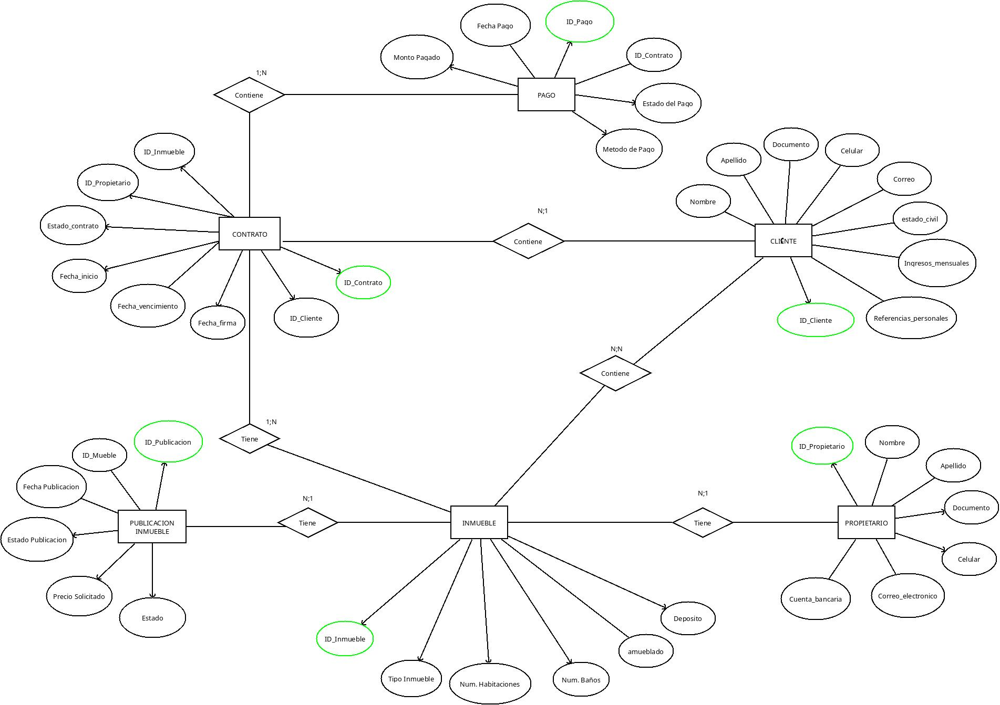
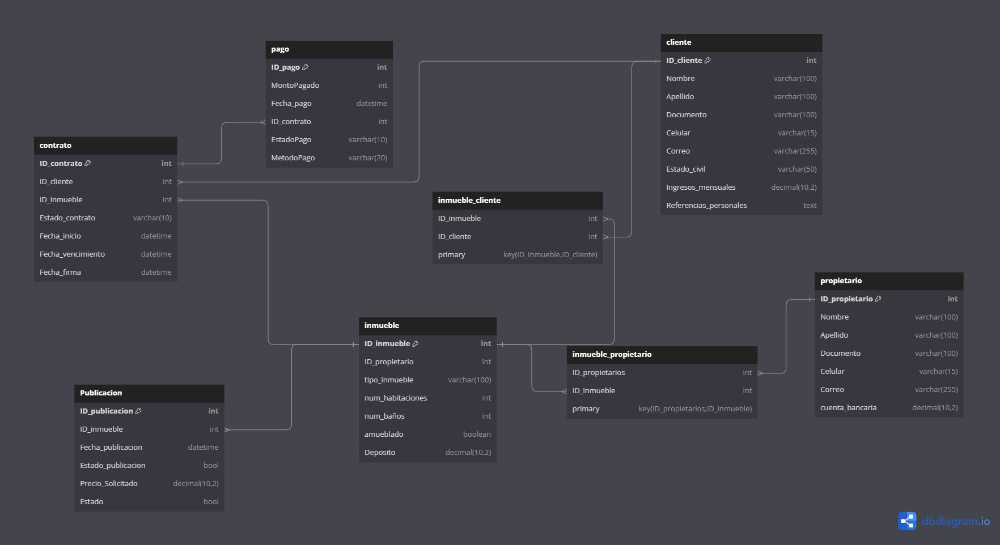

# Descripción del modelo de base de datos para la gestión inmobiliaria:

Nuestro cliente, la Agencia Inmobiliaria "DataVivienda", nos ha encargado el desarrollo de una base de datos robusta para gestionar la información de propiedades, clientes, contratos, pagos y publicaciones. La base debe ser capaz de almacenar detalles sobre los clientes, los propietarios de las inmuebles, los contratos de arrendamiento o compra-venta, los pagos realizados, así como los servicios asociados a cada propiedad y las publicaciones para la comercialización de las mismas.

## El modelo debe contemplar las siguientes entidades y relaciones:
 
- Clientes: Cada cliente se identifica de forma única a través de un ID y sus datos personales como nombre, apellido, documento de identidad, contacto telefónico, correo electrónico, ingresos mensuales, referencias personales y estado civil.
- Propietarios: Al igual que los clientes, los propietarios tienen un identificador único y se almacena su información personal. Además, se incluye su cuenta bancaria para gestionar los cobros de alquileres o ventas.
- Inmuebles: Cada propiedad tiene su propio identificador y se clasifica según tipo (casa, apartamento, estudio). Se detallan las características como número de habitaciones, baños, si está amueblada y un depósito en garantía.
- Contratos: Se manejan contratos de arrendamiento o compra-venta, cada uno con un identificador único. Estos documentos establecen el inicio y vencimiento del contrato, el estado del mismo (activo, vencido, cancelado) y la fecha de firma. Además, vinculan a la propiedad, al cliente y al propietario.
- Pagos: Cada pago se registra con un ID y está relacionado con un contrato específico. Se anota la fecha del pago, el monto, el método de pago y el estado del pago.
- Publicaciones de Inmueble: Para la promoción de las propiedades, se gestionan publicaciones que contienen información como un ID único, el precio solicitado, la fecha de publicación, el estado de la misma (activa, inactiva).
  
El modelo entidad-relación detallará cómo estas entidades se interrelacionan entre sí, garantizando la integridad y coherencia de los datos. La normalización nos ayudará a eliminar redundancias y dependencias para optimizar el almacenamiento de datos y las consultas.

## 1. Diseño Conceptual:
Para saber cómo estructurar la base de datos haremos un diagrama con las entidades, sus atributos y sus relaciones.

## 2. Diseño Lógico:
Definida la estructura la convertiremos en un modelo relacional de tablas.
 
