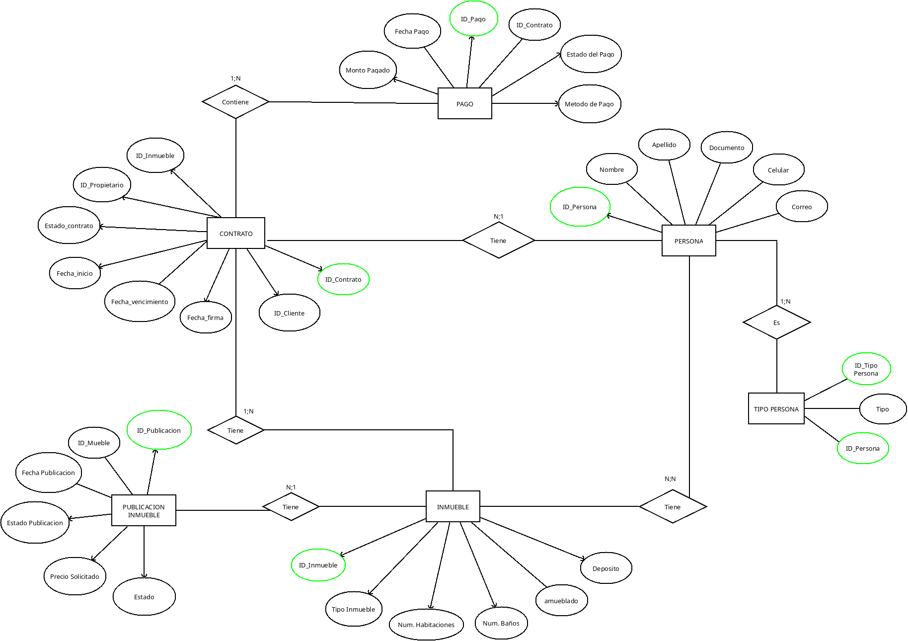
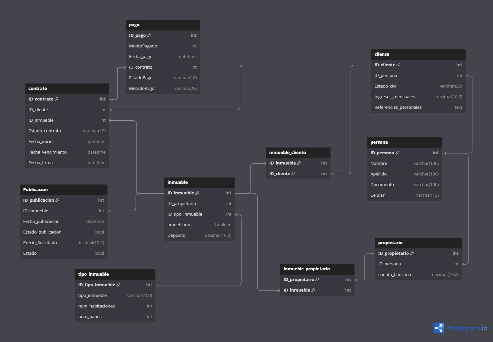

# Descripción del modelo de base de datos para la gestión inmobiliaria:

Nuestro cliente, la Agencia Inmobiliaria "DataVivienda", nos ha encargado el desarrollo de una base de datos robusta para gestionar la información de propiedades, clientes, contratos, pagos y publicaciones. La base debe ser capaz de almacenar detalles sobre los clientes, los propietarios de las inmuebles, los contratos de arrendamiento o compra-venta, los pagos realizados, así como los servicios asociados a cada propiedad y las publicaciones para la comercialización de las mismas.

## Entidades Principales y Relaciones:

Persona: Esta entidad representa a los individuos asociados con la agencia, ya sean clientes o propietarios. Cada persona tiene un identificador único (ID_Persona) y atributos para almacenar el nombre, apellido, documento de identidad, número de celular y correo electrónico.
Tipo Persona: Clasifica a las personas en diferentes categorías (por ejemplo, cliente o propietario) utilizando un identificador único (ID_TipoPersona) y el tipo correspondiente.
Inmueble: Cada propiedad inmobiliaria está representada con un identificador único (ID_Inmueble) y se categoriza por tipo (casa, apartamento, estudio, etc.). Incluye detalles como el número de habitaciones, número de baños, si está amueblado y un depósito de garantía.
Contrato: Se manejan contratos de arrendamiento o compraventa, identificados por un ID_Contrato único. Los contratos almacenan información sobre el estado del contrato (activo, vencido, cancelado), las fechas de inicio, vencimiento y firma. Cada contrato está asociado con un inmueble, un cliente (ID_Cliente) y un propietario (ID_Propietario).
Pago: Los pagos realizados están asociados con los contratos a través de un ID_Pago. Se registra la fecha del pago (Fecha_Pago), el monto pagado, el método de pago y el estado del pago.
Publicación Inmueble: Para la promoción de las propiedades, se crean publicaciones que contienen un ID_Publicacion único, el precio solicitado, la fecha de publicación y el estado de la publicación (activa, inactiva).
  
El modelo entidad-relación detallará cómo estas entidades se interrelacionan entre sí, garantizando la integridad y coherencia de los datos. La normalización nos ayudará a eliminar redundancias y dependencias para optimizar el almacenamiento de datos y las consultas.

## 1. Diseño Conceptual:
Para saber cómo estructurar la base de datos haremos un diagrama con las entidades, sus atributos y sus relaciones.

## 2. Diseño Lógico:
Definida la estructura la convertiremos en un modelo relacional de tablas.
 

## 3. Creación Base de Datos:
Con código SQL crearemos toda la estructura que albergará los datos. La carga de datos la haremos de forma manual en todas las tablas [Base de Datos SQL](https://github.com/cccaml/012024_BD_UEX/blob/main/BaseSQL.sql).

## 4. Normalización de la Base de Datos:
La normalización de la base de la datos seria la siguiente. [Normalización SQL](https://github.com/cccaml/012024_BD_UEX/blob/main/Normalizacion.sql)

